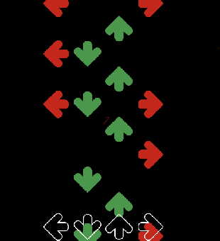

# Open 2D Robeats
basically a 2d robeats player that plays robeats maps. credit to robeats for the sounds and maps (scatman &amp; freedom dive)
and ya that it lol

## Building and Testing

Requires [rojo](https://github.com/rojo-rbx/rojo).

```bash
# Build place
rojo build -o 2dRobeats.rbxlx

# Open place (Windows-only)
start 2dRobeats.rbxlx

# Start Rojo server
rojo serve
```

## License

Also this game is really mediocre and it doesn't have accuracy visualizers, but can be added easily.
It's more of a finish game base.



This project is licensed under the GNU 3.0 License. Read [LICENSE](LICENSE) for more details.
